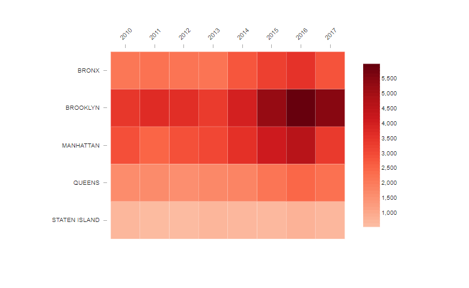
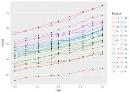
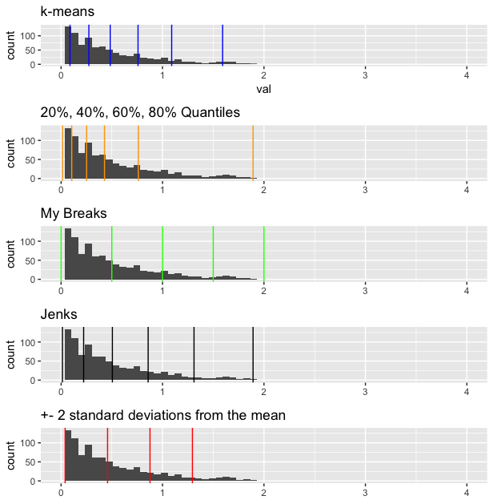

# Color Analysis 

For any EDA or visulization, you must encounter the following scenario: 

All these visuals are at its essense: represent a given measure with the intensity of a color. 

In many tools available, most software take care of the mapping values to color for you. However, have you ever wonder what is the best way to create breaks for any continous variable? In other words, if the deafult setting is not ideal, and nothing interesting in the visual are showing, could it be due to the 'non-ideal' way of breaking breaks and how can you fix such problem? 

In this Git Repo, I want to discuss several common way to create breaks for coloring on a given continous measure. 

  - __mean - sd__: you can create breaks based on the mean, and 1/2 or more sd away from mean. While it works well for normally distributed measure, it is not ideal for any measure with extreme values or clustered values. 
  
  - __jenks__: [jenks](https://en.wikipedia.org/wiki/Jenks_natural_breaks_optimization) is another popular way to create color breaks based on a clustering algorithem. However, you have to choose a k (number of groups), which might change the view. 
  
  - __kmeans__: similar to jenks, we can also try to use k-means as a way to create breaks (groups) to color a continous variable. 
  
  - __quantile__: quantile is a great way if you want to make sure each groups contains approx. similar points.

In summary, no way are perfect in all cases. You should try different methods with different groups and breaks to see the optimal choice for the given problem. Based on such motivation, I include an R script that will generate the different approach in one shot. Looks like the below example. 

